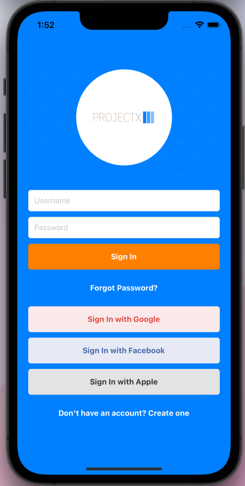
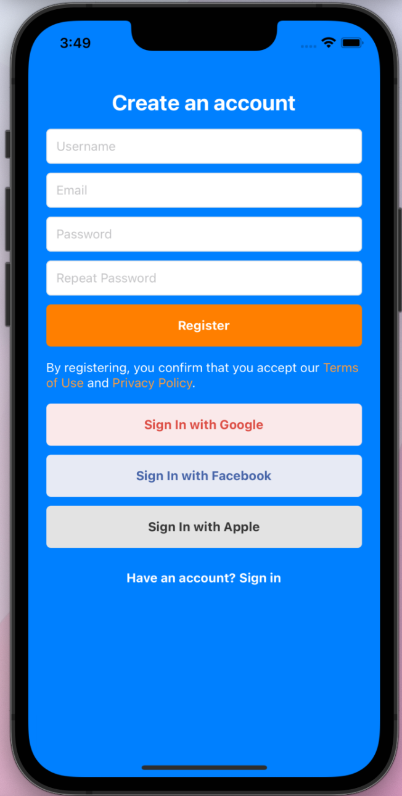

# AIM
AIM

Aim, was founded with the mission of helping young job seekers find their ideal career path and succeed in their chosen field. We believe that everyone has the potential to reach their goals, but that finding the right opportunities and guidance can be a challenge. That's where Aim comes in. Through continuous onboarding and proprietary opportunity selection criteria, Aim helps users find customized career opportunities. With Aim, users receive ongoing guidance and support, and the company has an internal review process to ensure that users are on track to achieve their goals. Aim is poised to disrupt the $200 billion recruiting industry and become the go-to resource for young professionals looking to take control of their careers.

## Completed Screens

  
   
   
   
   

